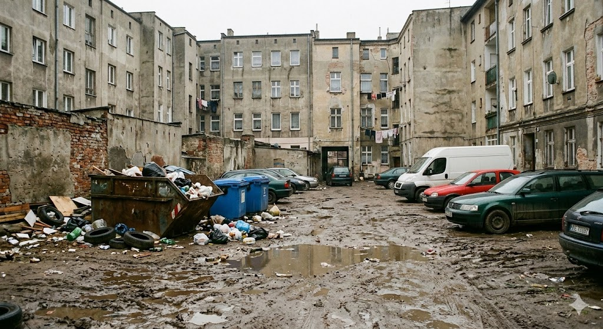

# Budżet Obywatelski 2026 – Wejherowo

Zbiór projektów zgłaszanych do Budżetu Obywatelskiego w Wejherowie na rok 2026.

## Zawartość

Każdy projekt ma swój folder z:

- **`summary.md`** – skrót pomysłu + pytania do urzędników
- **`*.md`** – szczegółowy opis projektu

## Projekty

| Nr | Projekt | Tematyka |
|----|---------|----------|
| 01 | [Bezpieczeństwo pieszych](projects/01%20bezpieczenstwo_pieszych/pakiet_bezpieczeństwa_pieszego.md) | Sobieskiego – radar, nasadzenia, doświetlenie |
| 02 | [Psi Park](projects/02%20psi_park/psi_park.md) | Wybieg + kosze z woreczkami na Os. Przyjaźni |
| 03 | [Smart toilet](projects/03%20smart_toilet/smart_toilet.md) | Dozowniki w Parku Majkowskiego |
| 04 | [Czysty Las](projects/04%20czyty_las/czysty_las.md) | Sprzątanie Kalwarii i lasu, fotopułapki, prewencja |
| 05 | [Miejski pumptrack](projects/05_miejski_pumptrack/miejski_pumptrack.md) | Tor dla rowerów, rolek i hulajnóg |
| 06 | [Kuźnia gier](projects/06_kuznia_gier/kuznia_gier.md) | Projekty miękkie – planszówki, animatorzy, Biblioteka |
